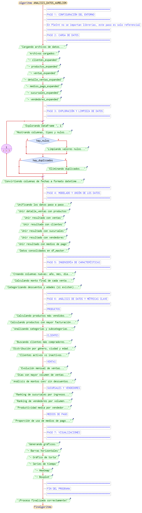

## ✅ Proyecto Aurelion – Análisis Inteligente de Ventas
**Fundamentos de Inteligencia Artificial — IBM SkillsBuild**
 
- **Alumno**: Lennin Billey Temoche Gómez
- **Curso**: Fundamentos de Inteligencia Artificial
- **Camada**: 11 martes 
- **Docente**: Mirta Gladys Julio  
- **Fecha de entrega**: 09 de Noviembre de 2025

---

## 1.1 Tema, Problema y Solución

### ✅ Tema  
**Aplicación de técnicas de análisis de datos e Inteligencia Artificial para la optimización estratégica de ventas mediante el análisis integrado de datos comerciales en la tienda Aurelion.**

El proyecto **“Tienda Aurelion”** evidencia cómo el análisis de datos y la estadística aplicada pueden convertir una operación tradicional de ventas en una **gestión estratégica basada en datos**. Durante la primera etapa (Spring 1), se desarrolló un proceso completo de ingestión, limpieza, integración y enriquecimiento de datos, consolidando diversas fuentes en un único modelo analítico `df_master`. Esto permitió comprender el estado actual del negocio, identificar patrones clave y responder preguntas fundamentales relacionadas con ventas, clientes, productos y sucursales.En la segunda etapa (Spring 2), se incorporó un análisis estadístico exhaustivo con el fin de profundizar en el comportamiento de las variables numéricas y validar hallazgos mediante herramientas cuantitativas. Se aplicaron técnicas como estadística descriptiva, detección de outliers, análisis de correlaciones, cálculo de intervalos de confianza y segmentación RFM.Estos análisis proporcionaron insights valiosos para la toma de decisiones estratégicas, permitiendo a la tienda Aurelion optimizar sus operaciones comerciales y focalizar esfuerzos en los segmentos de mayor valor.

### ✅ Problema  
La tienda Aurelion recopila una gran cantidad de datos sobre clientes, productos y ventas. Sin embargo, no cuenta con un sistema que permita analizarlos de forma integral, lo que genera los siguientes desafíos:

1. **Desconocimiento del cliente**  
   No se identifican patrones de compra, lo que impide reconocer a los clientes más valiosos y sus preferencias.

2. **Estrategias de venta genéricas**  
   Las campañas de marketing y promociones se aplican de forma uniforme, lo que reduce el retorno de inversión y genera oportunidades perdidas.

3. **Ineficiencia operativa**  
   Consultas básicas como *“¿Cuál fue el producto más vendido el mes pasado?”* requieren procesos manuales que consumen tiempo y recursos.

La empresa opera de forma **reactiva**, sin una estrategia basada en datos que le permita tomar decisiones proactivas para impulsar su crecimiento.

### ✅ Solución  
Implementar un **flujo de trabajo analítico automatizado en Python** que convierta los datos crudos en **información accionable**. Este flujo consta de tres etapas principales:

1. **Consolidación de datos**  
   Integración de las tablas `Clientes`, `Productos`, `Ventas` y `Detalle de Venta` en un único DataFrame maestro, generando una visión 360° del negocio.

2. **Análisis descriptivo automatizado**  
   Generación automática de respuestas a preguntas clave del negocio:
   - Top 10 productos más vendidos (por cantidad e ingresos).
   - Ranking de clientes más valiosos.
   - Ventas por categoría y ciudad.
   - Evolución mensual de ventas.

3. **Base para modelos de IA**  
   Este análisis servirá como punto de partida para futuras aplicaciones de Machine Learning, como la segmentación de clientes mediante algoritmos como K-Means.

**Herramientas utilizadas**:  
- **Python**: `pandas`, `matplotlib`, `seaborn`  
- **GitHub Copilot**: Asistente de codificación para acelerar el desarrollo y sugerir soluciones eficientes en el manejo de datos.

---

## 1.2 Dataset de Referencia

### ✅ Fuente  
Los datos proporcionados por la cátedra en formato Excel (.xlsx), fueron expandidos y distribuidos en siete archivos:

- `clientes_expanded.xlsx`  
- `productos_expanded.xlsx`  
- `ventas_expanded.xlsx`  
- `detalle_ventas_expanded.xlsx`  
- `sucursales_expanded.xlsx`  
- `vendedores_expanded.xlsx`  
- `medios_pago_expanded.xlsx`

### ✅ Descripción  
El conjunto de datos representa un ecosistema de ventas minoristas, capturando las interacciones entre clientes, productos, sucursales y métodos de pago. Permite responder preguntas como:

- **¿Qué se vendió?** → Productos  
- **¿Quién compró?** → Clientes  
- **¿Cuándo?** → Fecha de la transacción  
- **¿Dónde?** → Sucursal de la venta  
- **¿Cómo?** → Medio de pago y cantidad adquirida

### ✅ Escala del Dataset  

| Tabla                 | Registros |
|-----------------------|-----------|
| clientes_expanded     | 100       |
| productos_expanded    | 100       |
| ventas_expanded       | 720       |
| detalle_ventas_expanded| 2016     |
| sucursales_expanded   | 6         |
| vendedores_expanded   | 36        |
| medios_pago_expanded  | 4         |

### ✅ Modelo de Datos  
Se emplea un **modelo estrella expandido**, compuesto por:

- **Tablas de dimensión** (describen entidades):
  - `Clientes`
  - `Productos`
  - `Sucursales`
  - `Categorías`
  - `Métodos de Pago`

- **Tablas de hechos** (registran transacciones):
  - `Ventas`
  - `Detalle de Venta`

---

### ✅ Estructura Detallada de las Tablas

A continuación se presenta la estructura de las tablas fuente y las columnas clave que se integran y utilizan en el `df_master`:

#### 1. Tabla de Dimensión: `clientes_expanded`

| Columna               | Tipo de Dato | Descripción                          |
|-----------------------|--------------|--------------------------------------|
| `id_cliente`          | int64        | Identificador único (Clave Primaria) |
| `nombre_cliente`      | object       | Nombre y apellido del cliente        |
| `email`               | object       | Dirección de correo electrónico      |
| `ciudad`              | object       | Ciudad de residencia                 |
| `fecha_alta`          | datetime64   | Fecha de registro del cliente        |
| `genero`              | object       | Género del cliente                   |
| `edad_rango`          | object       | Rango de edad del cliente            |
| `activo_como_cliente` | bool         | Estado de actividad del cliente      |


#### 2. Tabla de Dimensión: `productos_expanded`

| Columna           | Tipo de Dato | Descripción                          |
|-------------------|--------------|--------------------------------------|
| `id_producto`     | int64        | Identificador único (Clave Primaria) |
| `nombre_producto` | object       | Nombre comercial del producto        |
| `categoria`       | object       | Categoría a la que pertenece         |
| `precio_unitario` | float64      | Precio unitario de venta             |
| `subcategoria`    | object       | Subcategoría del producto            |

#### 3. Tabla de Dimensión: `sucursales_expanded`

| Columna         | Tipo de Dato | Descripción                          |
|-----------------|--------------|--------------------------------------|
| `id_sucursal`   | int64        | Identificador único (Clave Primaria) |
| `nombre_sucursal`| object       | Nombre de la sucursal                |
| `ciudad`        | object       | Ciudad donde se encuentra            |
| `provincia`     | object       | Provincia donde se encuentra         |

#### 4. Tabla de Dimensión: `medios_pago_expanded`

| Columna             | Tipo de Dato | Descripción                          |
|---------------------|--------------|--------------------------------------|
| `id_medio_pago`     | int64        | Identificador único (Clave Primaria) |
| `nombre_medio_pago` | object       | Nombre del método de pago            |

#### 5. Tabla de Dimensión: `vendedores_expanded`

| Columna          | Tipo de Dato | Descripción                          |
|------------------|--------------|--------------------------------------|
| `id_vendedor`    | int64        | Identificador único (Clave Primaria) |
| `nombre_vendedor`| object       | Nombre del vendedor                  |
| `id_sucursal`    | int64        | Clave foránea a `SUCURSALES`         |
| `fecha_ingreso`  | datetime64   | Fecha de ingreso del vendedor        |
| `activo`         | bool         | Estado de actividad del vendedor     |

#### 6. Tabla de Hechos: `ventas_expanded`

| Columna             | Tipo de Dato | Descripción                          |
|---------------------|--------------|--------------------------------------|
| `id_venta`          | int64        | Identificador único (Clave Primaria) |
| `fecha`             | datetime64   | Fecha y hora de la venta             |
| `id_cliente`        | int64        | Clave foránea a `CLIENTES`           |
| `id_sucursal`       | int64        | Clave foránea a `SUCURSALES`         |
| `id_vendedor`       | int64        | Clave foránea a `VENDEDORES`         |
| `id_medio_pago`     | int64        | Clave foránea a `MEDIOS_PAGO`        |
| `nombre_cliente`    | object       | Nombre del cliente (redundante)      |
| `email`             | object       | Email del cliente (redundante)       |
| `medio_pago_original`| object      | Método de pago (texto original)      |
| `estado_venta`      | object       | Estado de la venta                   |
| `monto_bruto`       | float64      | Monto total de la venta antes desc.  |
| `monto_neto`        | float64      | Monto total de la venta después desc. |


#### 7. Tabla de Hechos: `detalle_ventas_expanded`

| Columna                | Tipo de Dato | Descripción                          |
|------------------------|--------------|--------------------------------------|
| `id_venta`             | int64        | Clave foránea a `VENTAS`             |
| `id_producto`          | int64        | Clave foránea a `PRODUCTOS`          |
| `nombre_producto`      | object       | Nombre producto (redundante)         |
| `cantidad`             | int64        | Número de unidades vendidas          |
| `precio_unitario`      | float64      | Precio unitario al momento de venta  |
| `importe`              | float64      | Cálculo: `cantidad * precio_unitario` |
| `descuento_aplicado_pct`| int64        | % de descuento aplicado (0-100)      |
| `subtotal`             | float64      | Importe con descuento aplicado       |


> **Nota**: Después de la unificación, el DataFrame `df_master` contendrá columnas de todas estas tablas, renombradas donde sea necesario (ej. `nombre_producto_x`, `precio_unitario_x` del detalle, `nombre_producto_y`, `precio_unitario_y` del producto, `ciudad_x` del cliente, `ciudad_y` de la sucursal, `id_sucursal_x` de ventas, `id_sucursal_y` de vendedores). También se agregan columnas de ingeniería de características como `año`, `mes`, `dia_nombre`, `descuento_pct` (descuento_aplicado_pct / 100), y `monto_final` (subtotal con descuento).

> **Notas**: Los campos redundantes deben ignorarse o eliminarse en el análisis. Se usan solo los IDs para mantener la integridad referencial.

---

## 1.3 Información, Pasos, Pseudocódigo y Diagrama del Programa

### ✅ Descripción del Funcionamiento  
El programa es un script en Python que automatiza el proceso de análisis de datos de la tienda Aurelion. Realiza:

1. **Carga** de los 7 archivos Excel.
2. **Limpieza** de datos (nulos, duplicados, tipos de datos).
3. **Unificación** en una tabla maestra (`df_master`).
4. **Ingeniería de características** (extracción de año, mes, día de semana).
5. **Análisis descriptivo** de 6 preguntas de negocio.
6. **Visualización** de resultados mediante gráficos.

Finalmente, presenta los resultados en consola y gráficos, sirviendo como base para decisiones estratégicas.

### ✅ Pasos del Desarrollo

1. **Cargar y Consolidar Datos**: Uso de `pandas.read_excel()` para cargar los archivos. Limpieza y unión de tablas mediante `merge()`.
2. **Limpieza y Conversión**: Asegurar tipos de datos correctos, especialmente para fechas. Verificar y manejar (aunque en este dataset no hubo) valores nulos.
3. **Ingeniería de Características**: Crear columnas derivadas (`año`, `mes`, `dia_nombre`, `descuento_pct`, `monto_final`).
4. **Análisis Estadístico Básico y Avanzado**: Calcular estadísticas descriptivas, identificar distribuciones, analizar correlaciones (Pearson y Spearman), detectar outliers (IQR, Z-score) y calcular intervalos de confianza.
5. **Análisis de Negocio Específico**: Realizar análisis RFM de clientes, análisis de ingresos por producto y análisis temporal de ventas.
6. **Visualización de Resultados**: Generar gráficos relevantes (histogramas, box plots, violin plots, heatmaps, scatter plots, bar plots, series de tiempo).
7. **Interpretación y Documentación**: Consolidar hallazgos, interpretarlos en el contexto del negocio y documentar el proceso y los resultados.


### ✅ Pseudocódigo (Completo)

```plaintext
dame el codigo para seinpt : INICIO_PROGRAMA

// ============================================
// PASO 1: CONFIGURACIÓN DEL ENTORNO
// ============================================
IMPORTAR librerías necesarias:
    - pandas
    - matplotlib
    - seaborn
    - numpy (opcional para operaciones estadísticas)

// ============================================
// PASO 2: CARGA DE DATOS
// ============================================
CARGAR los siguientes DataFrames desde archivo o ruta:
    - clientes_expanded
    - productos_expanded
    - ventas_expanded
    - detalle_ventas_expanded
    - medios_pago_expanded
    - sucursales_expanded
    - vendedores_expanded

// ============================================
// PASO 3: EXPLORACIÓN Y LIMPIEZA DE DATOS
// ============================================
PARA cada tabla EN la lista de DataFrames:
    MOSTRAR columna, tipos de datos y valores nulos
    SI existen valores nulos:
        APLICAR estrategia de limpieza (rellenar, eliminar filas, etc.)
    SI existen duplicados:
        ELIMINAR duplicados si corresponde
FIN PARA

CONVERTIR columnas de fechas (fecha, fecha_alta, fecha_ingreso) al tipo datetime

// ============================================
// PASO 4: MODELADO Y UNIÓN DE LOS DATOS
// ============================================
// Se realizarán las uniones necesarias para formar un DataFrame maestro

UNIR detalle_ventas_expanded CON productos_expanded mediante id_producto ⇒ df_dv_prod
UNIR df_dv_prod CON ventas_expanded mediante id_venta ⇒ df_ventas_completas
UNIR df_ventas_completas CON clientes_expanded mediante id_cliente ⇒ df_vtas_clientes
UNIR df_vtas_clientes CON sucursales_expanded mediante id_sucursal ⇒ df_vtas_sucursal
UNIR df_vtas_sucursal CON vendedores_expanded mediante id_vendedor ⇒ df_vtas_vendedor
UNIR df_vtas_vendedor CON medios_pago_expanded mediante id_medio_pago ⇒ df_master

// df_master contendrá ahora información consolidada de cliente, producto, venta, sucursal, vendedor y medio de pago

// ============================================
// PASO 5: INGENIERÍA DE CARACTERÍSTICAS (FEATURE ENGINEERING)
// ============================================
CREAR nuevas columnas:
    - Año de venta (a partir de fecha)
    - Mes de venta
    - Día de la semana
    - Rango_etario_categorizado (opcional, basado en edad_rango)
    - Descuento_aplicado_pct_categorizado (segmentar nivel de descuentos)
    - Monto_final = subtotal - (subtotal * descuento_aplicado_pct)

// ============================================
// PASO 6: ANÁLISIS DE DATOS Y MÉTRICAS CLAVE
// ============================================

// ANÁLISIS DE PRODUCTOS
CALCULAR: Productos más vendidos (por cantidad total)
CALCULAR: Productos con mayor facturación (por subtotal o monto_final)
CALCULAR: Categorías y subcategorías más populares

// ANÁLISIS DE CLIENTES
CALCULAR: Clientes que más compran (por monto_total)
CALCULAR: Distribución por género, ciudad, edad
CALCULAR: Clientes inactivos vs activos

// ANÁLISIS DE VENTAS
ANALIZAR: Evolución de ventas por mes
ANALIZAR: Días de la semana con mayor volumen de ventas
ANALIZAR: Comparativa monto_bruto vs monto_neto, con descuentos

// ANÁLISIS DE SUCURSALES Y VENDEDORES
CALCULAR: Ranking sucursales por ingresos
CALCULAR: Vendedores con mayor volumen de ventas
CALCULAR: Productividad media por vendedor

// ANÁLISIS DE MEDIOS DE PAGO
CALCULAR: Proporción de medios de pago utilizados

// ANÁLISIS ESTADÍSTICO AVANZADO
CALCULAR: Estadísticas descriptivas (media, mediana, moda, desviación estándar)
CALCULAR: Recencia, Frecuencia, Valor Monetario para cada cliente
SEGMENTAR: Clientes en grupos RFM (Top, Medio, Bajo)
cALCULAR: Distribución de variables numéricas (skewness, kurtosis)
CALCULAR: Correlaciones (Pearson, Spearman) entre variables numéricas
DETECTAR: Outliers mediante IQR y Z-score
CALCULAR: Intervalos de confianza para montos de venta

// ============================================
// PASO 7: VISUALIZACIONES Y TABLEROS
// ============================================
GENERAR gráficos:
    - Barras horizontales (Top productos, Top clientes)
    - Histograma (distribución medios de pago, productos por categoría)
    - Serie de tiempo (ventas por mes)
    - Calor o heatmap (ventas por sucursal y mes)
    - Boxplot (variables numéricas distribución y outliers)
    - Violin plot (variables numéricas distribución y outliers)
    - rfm scatter plot (segmentación RFM)

// ============================================
// FIN DEL PROGRAMA
// ============================================
FINALIZAR_PROGRAMA
```

<h3>Diagrama de Flujo (Resumen Visual)</h3>
<p><em>Nota: El diagrama completo fue generado en PSeInt y se adjunta como imagen en el documento original. A continuación se presenta su estructura lógica:</em></p>

<p align="center">
  <a href="Aurelion_pseint.png">
    
  </a>
</p>


---

## 1.4 Sugerencias y Mejoras Aplicadas con GitHub Copilot

### ✅ Sugerencias Aceptadas

| Sugerencia | Beneficio |
|----------|-----------|
| Autocompletado de operaciones `groupby().sum().sort_values()` | Aceleró la creación de análisis de agregación. |
| Generación de plantillas de gráficos con `sns.barplot()`, `plt.title()` | Permitió centrarse en personalización estética. |
| Sugerencias de manejo de fechas con `pd.to_datetime()` | Mejoró la precisión en el análisis temporal. |

### ✅ Sugerencias Descartadas

| Sugerencia | Razón de Rechazo |
|----------|------------------|
| Uso de `lambda` o `list comprehensions` complejas para filtrado | Reducía legibilidad; se prefirió `.loc[]` y métodos explícitos de Pandas. |
| Implementación de K-Means para segmentación de clientes | Fuera de alcance: en esta etapa el proyecto es de **análisis descriptivo**, no predictivo. |

---

## 1.5 Programa en Python (Implementación en Jupyter Notebook)

### Archivo: `Proyecto_Aurelion_S2.ipynb`

### ✅ Funcionalidad  
El programa se implementa como un **Jupyter Notebook**, no como un script de consola. Esto permite:

- Documentar cada paso con **celdas Markdown** (explicaciones).
- Ejecutar **celdas de código individualmente** (Shift + Enter).
- Ver resultados **en línea** (tablas, gráficos, resúmenes).

### Interacción del Usuario

1. **Leer la documentación** en celdas Markdown.
2. **Ejecutar celdas de código en orden**.
3. **Observar resultados inmediatos**:
   - `df.head()`
   - `df.info()`
   - Gráficos integrados con `matplotlib`/`seaborn`.

### Ventajas del script Notebook Jupyter

| Ventaja | Descripción |
|--------|-------------|
| **Narrativa** | El notebook cuenta una historia: “de los datos a la decisión”. |
| **Reproducibilidad** | Cualquier persona puede ejecutarlo paso a paso. |
| **Exploración** | Ideal para validación, ajustes y presentaciones académicas. |
| **Documentación** | Todo el análisis está registrado y explicado. |

---

## SPRING 2
# Desarrollo de aplicación de técnicas estadisticas:
  1. Base de datos limpia y lista
  2. Calcular estadísticas básicas calculadas
  3. Identificar tipo de distribución de variables
  4. Análisis de correlaciones entre variables principales
  5. Detección deoutliers mediante curatiles y rangos
  6. Interpretar resultados para el problema de negocio
  7. Documentar


# Resumen Consolidado del Análisis Estadístico - Spring 2

Este informe presenta los hallazgos clave del análisis estadístico,
realizado sobre el dataset unificado `df_master` generado en el Spring 1, con el objetivo de comprender el comportamiento comercial mediante estadísticas
descriptivas, identificación de outliers, correlaciones, intervalos de
confianza, segmentación RFM, análisis de productos e interpretación
temporal de ventas. Logrando construir una visión integral del negocio, automatizar procesos analíticos y generar insights relevantes para la toma de decisiones comerciales.

## ✅ Logros destacados

| Dimensión | Resultado |
|---|---|
Consolidación de datos | Integración completa de **7 fuentes** en un DataFrame maestro de **2016 registros**  
Estadística descriptiva | Identificación clara de rangos, variabilidad y distribución de variables clave  
Análisis avanzado | Detección de outliers, correlaciones, intervalos de confianza y segmentación RFM  
Modelado de clientes | Clasificación estadística de ** clientes activos** en cinco segmentos de valor  
---


## ✅ 1. Estadísticas Descriptivas

El análisis descriptivo permitió caracterizar las principales variables
numéricas. Se identificó alta variabilidad en las variables monetarias,
así como distribuciones sesgadas hacia la derecha, indicando que pocas
transacciones de alto valor explican gran parte de los ingresos. En
contraste, las variables `cantidad` y `precio_unitario_x` muestran mayor
estabilidad y simetría.

### Indicadores Descriptivos Relevantes

| Indicador | Resultado | Interpretación |
|---|---|---|
| Coeficiente de variación en montos | > 50% | Alta dispersión: las ventas presentan variabilidad considerable entre transacciones. |
| Sesgo (Skewness) en montos | > 0.5 | Sesgo positivo: predominan ventas de bajo valor con presencia de operaciones de alto importe. |
| Variables más estables | Cantidad y precio unitario | Distribución más homogénea y sin variaciones extremas significativas. |


### Comportamiento de las ventas

| Métrica | Valor |
|---|---|
Ticket promedio por detalle | **$83.86**  
Rango estimado (IC 95%) | **$81.48 – $86.24**  
Cantidad promedio por ítem | **2.68 unidades**  
Precio unitario promedio | **$31.45**  

> Las ventas unitarias son estables, con valores influenciados tanto por cantidad como por precio del producto.

-----------------------------------------------------------------------

### Interpretación de Distribuciones Numéricas


<div style="display:flex; justify-content: center; gap:15px;">
  
  
</div>
<br><br>

Las visualizaciones (Boxplot + Violin Plot) confirman patrones clave en las variables numéricas:

- Las variables monetarias muestran **fuerte sesgo positivo**, típico en ventas: muchas transacciones pequeñas y pocas de alto valor.
- `descuento_aplicado_pct` presenta distribución **altamente sesgada y concentrada en 0**, reflejando uso poco frecuente del descuento.
- `cantidad` y `precio_unitario_x` exhiben distribuciones más **estables y sin outliers relevantes** bajo IQR.

Estas formas de distribución respaldan las estadísticas descriptivas y guían decisiones de preparación de datos y selección de técnicas analíticas.


## ✅ 2. Detección de Outliers

Para identificar valores atípicos se aplicaron los métodos **IQR** y **Z-score**, enfocándonos en detectar transacciones inusuales y comportamientos anómalos en descuentos.

| Variable | % Outliers | Observación |
|---|---:|---|
| Cantidad | 0% | No se observan cantidades fuera del comportamiento esperado. |
| Precio Unitario | 0% | Los precios se mantienen dentro del rango normal de variación. |
| Variables monetarias | **0.40% – 0.50%** | Pocas transacciones excepcionalmente altas, asociadas a compras grandes. |
| Descuento aplicado | **15.23%** (307 casos) | El descuento es poco frecuente y en proporciones específicas. |

> **Interpretación:** Los valores monetarios muestran casos aislados de transacciones grandes, consistentes con ventas puntuales de alto valor. La mayoría de los outliers corresponde a la variable de descuento, indicando que solo se aplica en situaciones muy particulares y con baja recurrencia.


------------------------------------------------------------------------

## ✅ 3. Correlación entre Variables

<p align="center"><b>Mapa de Calor de Correlaciones</b></p>
<p align="center">
  
</p>


Las correlaciones muestran relaciones clave entre las métricas comerciales, principalmente entre valores monetarios y cantidades vendidas.

| Relación | Coeficiente | Interpretación |
|---|---:|---|
| Cantidad ↔ Importe | **0.71** | A mayor cantidad comprada, mayor importe de la venta. |
| Precio Unitario ↔ Importe | **0.63** | Precios más altos tienden a generar tickets de mayor valor. |
| Importe ↔ Monto Final | **0.99** | El monto final prácticamente coincide con el importe calculado. |
| Monto Bruto ↔ Monto Neto | **1.00** | No existen diferencias entre monto bruto y neto (sin descuentos). |

> **Conclusión:** Las relaciones monetarias son altamente consistentes, mientras que la cantidad y el precio unitario influyen significativamente pero no determinan por completo el valor total de la venta.


------------------------------------------------------------------------

## ✅ 4. Intervalos de Confianza (95%)

**Monto final por detalle de venta:** - Media: \$82.06\
- IC 95%: \$79.71 --- \$84.41

Los intervalos estiman con precisión las verdaderas medias poblacionales
de las principales métricas.

------------------------------------------------------------------------

## ✅ 5. Segmentación RFM

La segmentación RFM permitió clasificar a los clientes según su **recencia**, **frecuencia** y **monto gastado**, identificando los grupos más valiosos para el negocio.

<p align="center">
  <a href="viz_rfm_formal.png">
    
  </a>
</p>

| Segmento | % Clientes | % Ingresos | Ticket Promedio |
|---|---:|---:|---:|
| Champions | **24%** | **55%** | $3,794.95 |
| Loyal | 23% | 21% | $1,481.52 |
| Potential | 21% | 14% | $1,084.05 |
| At Risk | 15% | 6% | $705.59 |
| Lost | 16% | 4% | $433.59 |

> **Interpretación:** Los segmentos **Champions** y **Loyal**, que representan cerca del 47% de la base de clientes, generan más del **75% de los ingresos**. Estos grupos deben ser prioritarios en estrategias de fidelización, retención y ofertas personalizadas.
------------------------------------------------------------------------

## ✅ 6. Análisis de Ingresos por Producto
El análisis de ingresos por producto reveló que un pequeño grupo de productos contribuye significativamente a los ingresos totales.
<p align="center">
  <a href="viz_productos_avanzado.png">
    
  </a>
</p>

| Producto | Total Ingresos |
|---|---|
Sprite 1.5L | **$4,269.04**  
Empanadas Congeladas | **$3,057.92**  
Desodorante Ambiente Aerosol | **$3,048.50**  
Pizza Congelada Muzzarella | **$2,914.48**  
Pepsi 1.5L | **$2,735.15**  

> Bebidas y congelados lideran la venta total y por ticket.

------------------------------------------------------------------------

## ✅ 7. Análisis Temporal de Ventas

<p align="center">
  <a href="viz_temporal_avanzado.png">
    
  </a>
</p>

El comportamiento de las ventas a lo largo del tiempo muestra una dinámica estable, sin patrones estacionales pronunciados:

- Se observan fluctuaciones semanales normales, sin cambios estructurales en la tendencia general.
- La distribución mensual de los importes no presenta variaciones significativas entre periodos.
- La prueba estadística **Kruskal-Wallis** (p = 0.3878) confirma la **ausencia de estacionalidad relevante**, indicando que el comportamiento de las ventas no depende significativamente del mes, sujeta a revisión.

> **Conclusión:** El flujo de ventas parece mantener estabilidad, lo que sugiere una demanda constante, pudiendo estar influenciada por factores externos no capturados en el dataset actual.

------------------------------------------------------------------------

### ✅ Conclusiones Generales

- Estabilidad en el comportamiento temporal de las ventas, sin estacionalidad significativa.
- Alta concentración del valor generado en un grupo reducido de clientes y productos estratégicos.
- Relevancia de monitorear descuentos y transacciones atípicas para garantizar control y consistencia en las ventas.
- Enfoque prioritario en clientes de alto valor para maximizar la rentabilidad y fomentar la fidelización.
- Toma de decisiones respaldada por evidencia estadística y análisis riguroso.
- Identificación clara de segmentos y líneas de producto clave para acciones comerciales dirigidas.
- Base sólida para el desarrollo de modelos predictivos y estrategias de crecimiento orientadas a datos.


## ✅ Próximos Pasos

| Enfoque | Acciones propuestas |
|---|---|
**Predicción** | Modelos de *forecasting* para proyección de ventas; *Churn prediction* utilizando modelos supervisados (Logistic Regression, Random Forest, XGBoost) para anticipar pérdida de clientes. |
**Segmentación Avanzada** | Extender análisis RFM con *clustering* (K-Means, DBSCAN) para identificar microsegmentos de clientes y patrones no visibles con reglas tradicionales. |
**Marketing Personalizado** | Campañas orientadas a segmentos clave con estrategias diferenciadas: retención (Champions, Loyal), reactivación (At-Risk, Lost). |
**Control de Descuentos** | Implementar reglas dinámicas y análisis de sensibilidad del descuento (*price elasticity*). |
**Detección de Anomalías** | Aplicar modelos de *anomaly detection* (Isolation Forest, Z-score dinámico) para identificar transacciones inusuales o fraudes. |
**Visualización y Reporting** | Construcción de dashboard ejecutivo (Power BI / Streamlit) con alertas automáticas y seguimiento de KPIs clave. |
**Automatización** | Pipeline de actualización automática de datos y reportes programados. |

> **Objetivo central:** evolucionar de análisis descriptivo a **análisis predictivo y prescriptivo**, aplicacando las mejores acciones propuestas para fortalecer la toma de decisiones basada en datos y potenciando el crecimiento del negocio.

