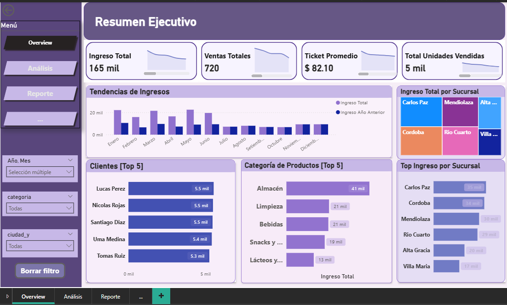
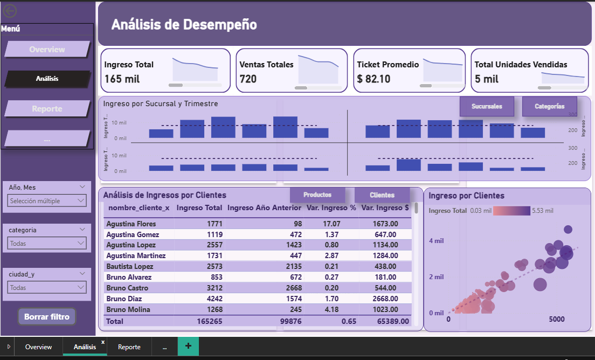
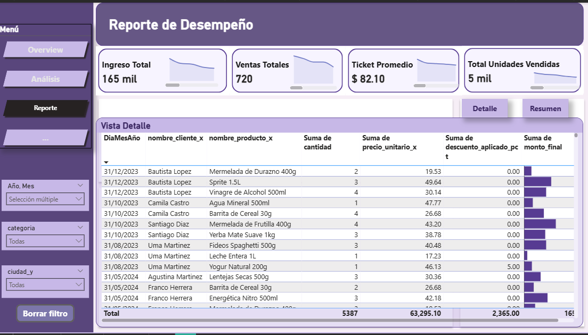
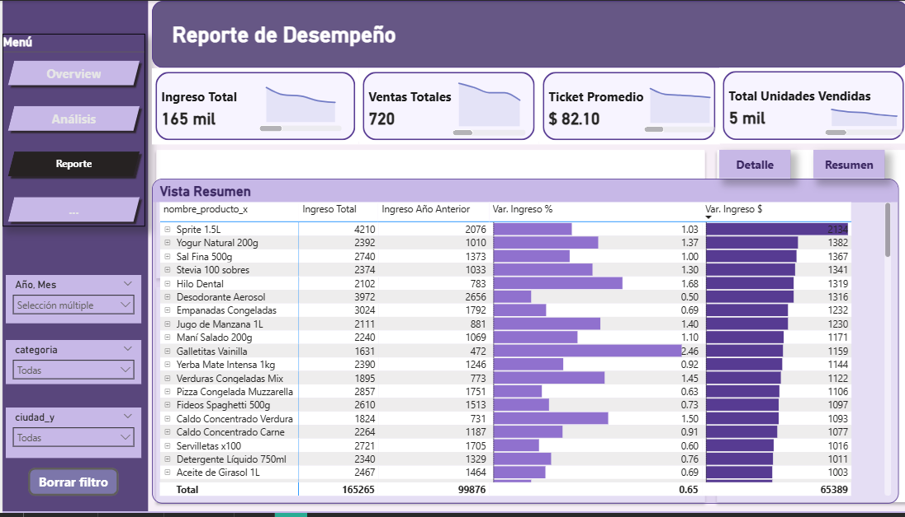

# SPRING 4 - Dashboard Power BI – Performance Overview Tienda Aurelion

## 1. Descripción General

Este documento describe el diseño, modelado y construcción del dashboard **Performance para la Tienda Aurelion** desarrollado en Power BI como parte final del proyecto SPRING 4.

El dashboard está compuesto por tres pestañas principales: **Resumen**, **Análisis** y **Reporte**, cada sección emplea medidas DAX, parámetros de campos, marcadores (Bookmarks), y elementos visuales interactivos que permiten el análisis ejecutivo y detallado de ventas, productos, clientes y desempeño comercial.

---

## 2. Modelo de Datos

### 2.1 Tablas Principales

| Tipo      | Tabla             | Descripción                                                    |
| --------- | ----------------- | -------------------------------------------------------------- |
| Hechos    | **FacVentas**     | Registros de ventas, facturación, cantidades, precios y fechas |
| Dimensión | **DimCalendario** | Tabla de fechas con jerarquías de Año, Trimestre, Mes y Día    |
| Dimensión | **DimCliente**    | Información de clientes, nombres y ubicaciones                 |
| Dimensión | **DimProducto**   | Información de productos y su categoría correspondiente        |
| Dimensión | **DimSucursal**   | Detalles de cada sucursal / tienda física                      |
| Dimensión | **DimMedioPago**  | Tipos de medio de pago utilizados                              |
| Dimensión | **DimVendedor**   | Datos de los vendedores participantes en las ventas            |

### 2.2 Relaciones

Todas las relaciones son de **uno a muchos (1..\*)** con **dirección de filtro activa** desde las tablas de dimensión hacia la tabla de hechos.

| Dimensión         | Tabla de Hechos | Columna en Dimensión | Columna en Hechos |
| ----------------- | --------------- | -------------------- | ----------------- |
| **DimCalendario** | FacVentas       | Date                 | fecha             |
| **DimCliente**    | FacVentas       | id_cliente           | id_cliente        |
| **DimProducto**   | FacVentas       | id_producto          | id_producto       |
| **DimSucursal**   | FacVentas       | id_sucursal          | id_sucursal       |
| **DimMedioPago**  | FacVentas       | id_medio_pago        | id_medio_pago     |
| **DimVendedor**   | FacVentas       | id_vendedor          | id_vendedor       |

---

## 3. Medidas DAX Base

```DAX
Ingreso Total = SUM('FacVentas'[monto_final])

Ingreso Año Anterior =
CALCULATE(
    [Ingreso Total],
    SAMEPERIODLASTYEAR('DimCalendario'[Date])
)

Var. Ingreso % =
DIVIDE(
    [Ingreso Total] - [Ingreso Año Anterior],
    [Ingreso Año Anterior],
    0
)
```

### 3.1 Otras Medidas Clave

```DAX
Total Órdenes = DISTINCTCOUNT('FacVentas'[id_venta])

Total Unidades Vendidas = SUM('FacVentas'[cantidad])

Ticket Promedio =
AVERAGEX(
    FacVentas,
    FacVentas[monto_final]
)

Ticket Promedio AA =
CALCULATE(
    [Ticket Promedio],
    SAMEPERIODLASTYEAR('DimCalendario'[Date])
)

Var. Ticket Promedio % =
DIVIDE(
    [Ticket Promedio] - [Ticket Promedio AA],
    [Ticket Promedio AA],
    0
)
```

---

## 4. Pestaña 1 – Resumen

### 4.1 KPIs Principales

- **Ingreso Total**
- **Ventas Totales**
- **Ticket Promedio**
- **Unidades Vendidas**

Cada KPI incluye comparación interanual (YoY).

### 4.2 Gráfico de Tendencia de Ingresos

**Visual**: Gráfico combinado (Columnas + Línea)

- Eje X: `DimCalendario[Mes]`
- Columnas: `[Ingreso Total]`
- Línea: `[Ingreso Año Anterior]`
- Tooltip: `[Var. Ingreso %]`

### 4.3 Top 5 Clientes y Categorías

- Top 5 Clientes
- Top 5 Categorías
- Mapa de Árbol por Sucursal
- Top Ingreso por Sucursal (barras)

```DAX
Rank Clientes =
RANKX(
    ALL(DimCliente[nombre_cliente_x]),
    [Ingreso Total],
    ,
    DESC,
    DENSE
)

Rank Categorías =
RANKX(
    ALL(DimProducto[categoria]),
    [Ingreso Total],
    ,
    DESC,
    DENSE
)


```

**Pestaña Resumen Ejecutivo**

---

<p align="center">
  <a href="img_dashboard_pbi/resumen.png">
    
  </a>
</p>

## 5. Pestaña 2 – Análisis de Desempeño

Esta sección está diseñada para visualizar el desempeño desde múltiples ejes con análisis comparativos Año vs Año Anterior, habilitando multifiltros y dinamismo completo usando parámetros y marcadores.

### 5.1 Interacción Dinámica mediante Botones

Se emplean Bookmarks para alternar vistas según la dimensión seleccionada:

Sucursales / Categorías: Ingresos por trimestre
Clientes / Productos: Ingreso y variación por cada entidad

Eje Dinámico (Sucursal / Categoría)
Parámetro de Campos:

- `DimSucursal[ciudad_y]`
- `DimProducto[categoria]`

### 5.2 Título Dinámico base

```DAX
Titulo Eje Sucursal Categoria =
SWITCH(
    TRUE(),
    SELECTEDVALUE('Eje Dinámico'[Eje Dinámico Campos]) = NAMEOF(DimSucursal[ciudad_y]),
        "Ingreso por Sucursal y Trimestre",
    SELECTEDVALUE('Eje Dinámico'[Eje Dinámico Campos]) = NAMEOF(DimProducto[categoria]),
        "Ingreso por Categoría y Trimestre",
    "Ingreso por Categoría y Trimestre"
)
```

Aplicado mediante **Formato condicional (fx)** en el título del gráfico.

### 5.3 Top N Dinámico (Clientes / Productos)

- Matriz que muestra Ingreso Total, Ingreso año anterior, Var. Ingreso % / $.
- Alternancia activa en botón para cambiar entre análisis por Cliente o Producto.

Eje dinámico (Clientes / Productos)
Parámetro de Campos:

- `DimCliente[nombre_cliente_x]`
- `DimProducto[nombre_producto_x]`

```DAX
Diferencia Ingreso ($) =
[Ingreso Total] - [Ingreso Año Anterior]
```

#### Título Dinámico Matriz

```DAX
Titulo Top N =
SWITCH(
    TRUE(),
    SELECTEDVALUE('Eje Top Productos Cliente'[Eje Top Productos Cliente Campos]) = NAMEOF(DimCliente[nombre_cliente_x]),
        "Análisis de Ingresos por Clientes",
    SELECTEDVALUE('Eje Top Productos Cliente'[Eje Top Productos Cliente Campos]) = NAMEOF(DimProducto[nombre_producto_x]),
        "Análisis de Ingresos por Productos",
    "Anális Dinámico de Ingresos por Clientes y Productos"
)
```

---

## 6. Gráfico de Dispersión (Scatter Plot)

- Utilizado para comparar Ingreso Actual vs Año Anterior
- Ejes adaptan según selección de Cliente o Producto
- Tamaño representa el valor total del ingreso

* Detalles: `Eje Top N Productos Cliente (Campos)`
* Eje X: `[Ingreso Total]`
* Eje Y: `[Ingreso Año Anterior]`

### Título Dinámico Scatter

```DAX
Titulo Scatter =
SWITCH(
    TRUE(),
    SELECTEDVALUE('Eje Top Productos Cliente'[Eje Top Productos Cliente Campos]) = NAMEOF(DimCliente[nombre_cliente_x]),
        "Ingreso por Clientes",
    SELECTEDVALUE('Eje Top Productos Cliente'[Eje Top Productos Cliente Campos]) = NAMEOF(DimProducto[nombre_producto_x]),
        "Ingreso por Productos",
    "Gráfico de Dispersión de Clientes y Productos"
)


```

**Pestaña Análisis de Desempeño**

---

<p align="center">
  <a href="img_dashboard_pbi/analisis.png">
    
  </a>
</p>

## 7. Pestaña 3 – Reporte de Desempeño

La pestaña Reporte ofrece análisis de tipo transaccional con dos modalidades visuales: **Vista Detalle** y **Vista Resumen**, intercambiables mediante botones que utilizan Bookmarks.

### 7.1 KPIs Dinámicos

```DAX
Clientes Activos = DISTINCTCOUNT(FacVentas[id_cliente])

Productos Activos = DISTINCTCOUNT(FacVentas[id_producto])

KPI Conteo Dinámico =
IF(
    SELECTEDVALUE('Eje Tabla Dinámica'[Eje Tabla Dinámica Fields]) = DimCliente[nombre_cliente_x],
    [Clientes Activos],
    [Productos Activos]
)

```

**Pestaña Reporte Ejecutivo**

---

<p align="center">
  <a href="img_dashboard_pbi/vista_detalle.png">
    
  </a>
  &nbsp;&nbsp;
  <a href="img_dashboard_pbi/vista_resumen.png">
    
  </a>
</p>

### 7.2 Marcadores

- **Categoría-BM**
- **Sucursal-BM**
- **Cliente-BM**
- **Producto-BM**
- **Resumen-BM**
- **Detalle-BM**

Configurados con:

- ✅ Objetos visuales
- ✅ Mostrar

---

## 8. Análisis de Resultados e Insights

Tras la implementación del Dashboard Performance Tienda Aurelion, se identificaron hallazgos clave que aportan valor estratégico e informativo para la gestión comercial y operativa. Los siguientes insights provienen del análisis visual interactivo de KPIs, métricas comparativas y rankings dinámicos.

### 8.1 KPIs Principales

En cada pestaña del dashboard se muestra un conjunto consistente de indicadores clave (KPIs), permitiendo al usuario obtener una visión rápida y continua del rendimiento comercial. A partir de su lectura cruzada entre las distintas secciones del dashboard, se destacan los siguientes hallazgos:

**Ingreso Total**

    Refleja el volumen de facturación consolidado. Se presenta en todas las pestañas para mantener contexto. Permite contrastar el ingreso total con el ingreso por categoría/sucursal, lo que permite monitorear cambios estacionales o efectos de campañas puntuales.

**Ventas Totales**

    Este indicador permite medir el ritmo operativo. Su visibilidad persistente en cada pestaña permite relacionar el volumen de ventas con clientes o productos dentro del ranking dinámico.
    La relación entre transacciones y productos vendidos también se refleja en la matriz de Detalle.

**Ticket Promedio**

    Muestra un ticket saludable para el entorno minorista. En las pestañas Análisis y Reporte, permite evaluar la efectividad de promociones y combinaciones de productos por cliente o categoría. Su evolución puede cruzarse con el tipo de producto para identificar oportunidades de upselling.

**Unidades Vendidas**
Análisis logístico: Este número cobra especial relevancia para planificación de stock. Combinado con el desglose por producto (pestaña Reporte - Vista Detalle), ayuda a detectar quiebres de stock o necesidades de reposición por item.

**Patrones Visuales Transversales**
Los KPIs presentan una mini gráfica de línea debajo, que aporta contexto visual de la tendencia histórica reciente (línea de sparkline), reforzando su análisis.
Esto permite detectar caídas o repuntes que pueden no ser evidentes solo con el valor numérico.
El hecho de que estén replicados en Resumen, Análisis y Reporte favorece el seguimiento continuo sin perder el contexto del rendimiento general.

---

### 8.2 Análisis de Insights

#### Insights Estratégicos

Enfocados en decisiones de negocio a mediano y largo plazo, alineadas a la estrategia comercial.

**Concentración de Ingresos (Ley de Pareto):**
El visual de categoría revela que el 80% del ingreso proviene de un subconjunto de productos y categorías, destacando "Almacén" con $41 mil, seguido por Limpieza y Bebidas. Esto orienta inversiones de abastecimiento, pricing y promociones hacia las categorías dominantes.

**Clientes de Alto Valor (Top Buyers):**
Clientes como Lucas Pérez, Nicolás Rojas, y Santiago Díaz muestran facturación individual cercana a $5.5 mil, ideales para diseñar programas de lealtad, promociones VIP o cross-selling estratégicos.

**Rendimiento Comercial por Región/Sucursal:**
El gráfico de mapa de árbol muestra que Carlos Paz, Córdoba y Mendiolaza son las sucursales con mayor participación de ingresos. Esto permite tomar decisiones sobre expansión, horarios, personal o activaciones comerciales locales.

**Tendencia de Crecimiento Interanual (YoY):**
El gráfico de dispersión en la pestaña Análisis muestra una alta densidad de burbujas en el cuadrante de crecimiento, indicando que muchos clientes y productos han mejorado su desempeño respecto al año anterior.

#### 8.2.2 Insights Operativos

Orientados a optimizar la gestión del día a día, trazabilidad y toma de acciones inmediatas.

**Productos con Alta Rotación**:
A partir del reporte detallado (vista resumen), productos como Sprite 1.5L, Yogur Natural 200g, y Empanadas Congeladas figuran como los más vendidos. Esto permite ajustar inventarios y planificación de compras a corto plazo.

**Control de Descuentos y Precios**:
En la vista de detalle se observan campos como descuentos aplicados y precios unitarios, útiles para identificar aplicaciones excesivas de descuentos o validar la correcta política de precios por cliente/producto.

**Planificación de Stock**:
Con 5,000 unidades físicas vendidas y rankings detallados por producto, se habilita una gestión ágil del inventario, detectando oportunidades de rotación, quiebre o sobrestock.

**Análisis por Canal Temporal (Trimestre)**:
El desglose visual por trimestre ayuda a identificar estacionalidad y patrones de consumo cíclico, facilitando campañas preventivas.

### 8.3 Conclusiones

El desarrollo e implementación del dashboard ha permitido crear una solución sólida de Business Intelligence, orientada a la toma de decisiones efectivas, gracias a los siguientes logros:

✅ Visibilidad Transaccional Completa:
La pestaña Reporte ofrece un desglose detallado de cada venta, producto y cliente, asegurando transparencia y trazabilidad de cada movimiento monetario.

✅ Agilidad para Usuarios del Negocio:
Gracias a los botones y filtros dinámicos, el tiempo de respuesta para encontrar información clave se reduce de minutos a segundos, mejorando la productividad y autonomía del equipo.

✅ Modelo Escalable y Flexible:
El diseño del modelo y las medidas DAX permiten que el dashboard escale fácilmente. Al incorporar nuevas sucursales, productos o campos relevantes, el sistema se adapta sin necesidad de rediseño estructural.

Este dashboard no solo cumple con los objetivos formales del proyecto, sino que también se convierte en una herramienta estratégica para optimizar decisiones comerciales en tiempo real, priorizar inversiones y profundizar el vínculo con los clientes. Al mostrar resultados por nivel permite a los equipos ejecutar acciones tácticas a corto plazo y, al mismo tiempo, formular estrategias comerciales y operativas basadas en evidencia. La combinación dinámica de reportes agregados y detallados potencia la eficiencia de todos los niveles del negocio

**Autor**: Lennin Billey Temoche Gómez

**Camada**: 11 - Martes

**Profesora**: Mirta Gladys Julio

**Fecha**: 18/12/2025

IBM Guayerd - Diciembre 2025
